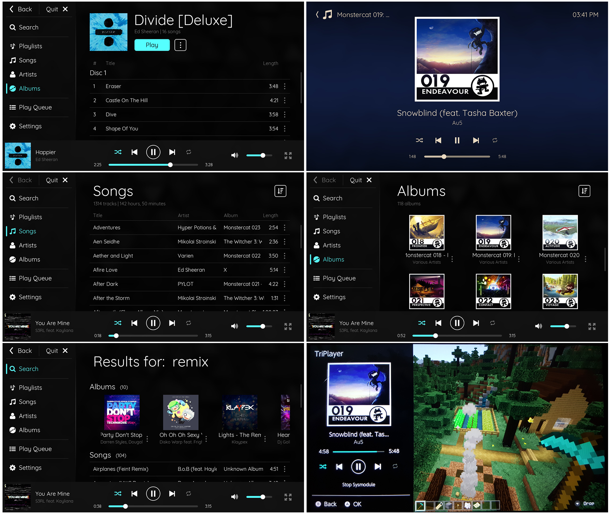

# TriPlayer

TriPlayer is a feature-rich audio player for the Nintendo Switch. It is able to play music in the background, including when playing games or on the HOME menu. TriPlayer requires a console capable of running Atmosphere. It gained it's name as it consists of **three** separate components, and initially its ability to play MP3 files.

[Download](https://github.com/tallbl0nde/TriPlayer/releases)

Please see the [wiki](https://github.com/tallbl0nde/TriPlayer/wiki) for a plethora of information regarding installation, compilation, reporting bugs and more!

## Features

* Audio playback while in-game
* No impact on game performance (runs on separate CPU core)
* Automatically organized library based on ID3 metadata
* Album/artist image scraping via TheAudioDB
* Custom playlists
* Fast library search
* Ability to add and remove songs to play queue
* Beautiful and easy to navigate interface
* Highly customizable with many settings that can be changed
* Basic 32-band equalizer
* Update in-app

And many more, download it to see for yourself! :)

* Supported audio formats:
  * FLAC
  * MP3
  * WAV

Curious about what's next? See my to-do list on [Trello](https://trello.com/b/teZpHfo1/triplayer)

## Screenshots

## Requirements

* A Nintendo Switch running Atmosphere 0.10.0+
   * 0.10.0+ has more memory available to sysmodules, so older versions aren't supported
* A relatively up-to-date firmware
   * Some components require functionality that was added to later firmwares, so 10.0.0+ is currently supported
* Music!

## Credits

For a complete list of credits and open source libraries used, please see the About tab in the application's settings!

## Support <3

There is absolutely no obligation, however if you have found this software useful you can support me on Ko-fi!

Knowing my software is being used is enough to motivate me to continue work on it!
